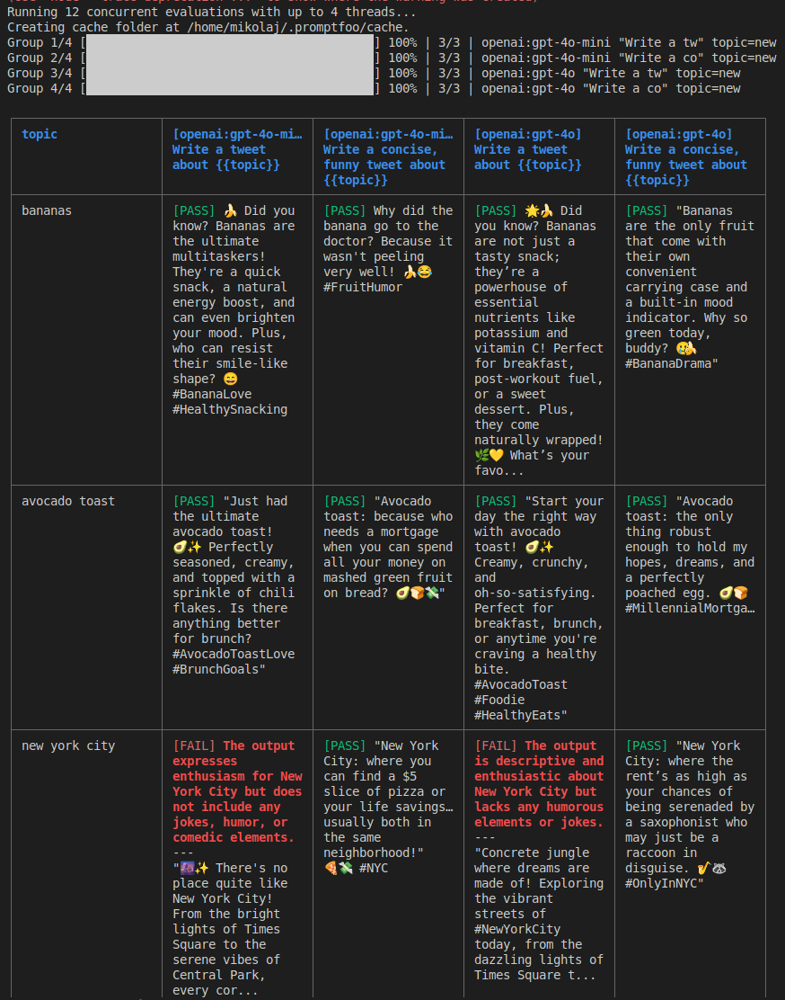
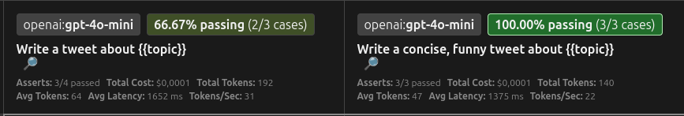

# How to Test Prompts with Promptfoo

In the dynamic world of generative AI, creating effective prompts is crucial for achieving desired results. <p></p>
But how can we ensure that our prompts work as expected in different scenarios and with different models? <p></p>
**The answer is Promptfoo** – a tool for evaluating and comparing prompts. <p></p>

## Real-world examples of Promptfoo usage

Before you start reading - here are real-life examples of using Promptfoo in development of LLM-based applications:

1. **Creating a Customer Service Chatbot:** You are using Promptfoo to test different prompts that should respond to typical customer questions. You are checking if the responses are correct, helpful, and in the right tone. You are testing different models to find the one that best handles the nuances of customer language.
2. **Building a Product Description Generator:** You are testing prompts that should create attractive and informative product descriptions based on their features. You are using Promptfoo to ensure that descriptions are consistent in style, contain all key information, and have appropriate length. You are comparing different models for creativity and accuracy of generated descriptions.
3. **Developing a User Review Analysis Tool:** You are testing prompts that should classify customer reviews as positive, negative, or neutral. Promptfoo is helping assess the accuracy of this classification for different types of reviews and languages. You are checking how changes in prompts affect the precision of analysis.
4. **Implementing Code Generation Features:** You are creating a tool that generates code snippets based on user descriptions. You are using Promptfoo to test different prompts for syntax correctness of generated code, its functionality, and compliance with user descriptions. You are comparing different models for code quality in various programming languages.
5. **Creating an Article Summarization Application:** You are testing prompts that should create short and concise summaries of long texts. Promptfoo is helping evaluate whether summaries maintain key information and are understandable. You are comparing different models for quality and length of generated summaries.

**In each of these cases, Promptfoo helps developers systematically test, compare, and optimize the use of language models, ensuring higher quality and reliability of created applications.**

In this article, I will guide you through the installation process, first evaluation, results visualization, their detailed discussion, and attempt to draw conclusions. It's best if you follow these steps together with me on your computer to get the most out of this guide.

**The article describes steps for Ubuntu on the Bash shell. Users of other systems should check the Promptfoo documentation for appropriate instructions, as Node.js and package manager installation may differ.**

Versions used in this article: <p></p>
**Node:** 22.6.0 <br />
**NPM:** 10.9.1 <br />
**Promptfoo:** 0.112.4

## 1. Installing Promptfoo

Before diving into the world of evaluation, we need to install `Promptfoo`. It's a tool based on `Node.js`, so make sure you have `Node.js` environment and `npm` package manager installed (usually installed together with Node.js).

Open a terminal and run the following command:

```bash
npm install -g promptfoo
```

This command will install `Promptfoo` globally in your system, allowing you to use it in any project. <p></p>

After installation is complete, you can verify if everything went well by typing:

```bash
npx promptfoo --version
```

If you see the installed version number of `Promptfoo`, it means the installation was successful.

## 2. Preparing the Test Environment – Creating a Dedicated Folder

For better work organization, it's recommended to create a dedicated folder where we'll store `Promptfoo` configuration files and other related resources. Choose a convenient location on your disk and run the following commands in the terminal:

```bash
mkdir promptfoo_project
cd promptfoo_project
```

From now on, all `Promptfoo` configuration files will be created inside this folder.

## 3. Configuring Promptfoo

With `Promptfoo` installed and the environment prepared, we can proceed with the first evaluation. In this step, we'll define the basic test configuration and choose the models we want to test.

### Test Definition:

Tests in Promptfoo are defined in configuration files (usually in `YAML` or `JSON` format). You specify the prompts you want to test and various test cases (input data). <p></p> You can also define assertions – expected properties of model outputs for each test case (more about this and other components of results will be covered later in the text).

Although configuration can be done manually, in this guide we'll use the interactive `Promptfoo` tool to initialize the basic configuration. Make sure you're still in the `promptfoo_project` folder and run:

```bash
promptfoo init
```

After running this command, `Promptfoo` will ask you to make several decisions about your test configuration.

On the first screen, you'll see a list of options that will help `Promptfoo` configure initial tests according to your intentions:

1. **Not sure yet:** Choose this option if you're just starting and want to generally familiarize yourself with Promptfoo. **This is the most appropriate option for the first evaluation, and this is what we'll choose.**
2. **Improve prompt and model performance:** This option is ideal if you want to compare different prompts or models for a specific task.
3. **Improve RAG performance:** Choose this option if you're testing a Retrieval-Augmented Generation system and want to evaluate how well your prompts utilize retrieved information.
4. **Improve agent/chain of thought performance:** This option is for testing more complex systems, such as AI agents or chains of thought.
5. **Run a red team evaluation:** Choose this option if you want to evaluate how well your model handles potentially harmful or unwanted queries.


On the second screen, `Promptfoo` will ask you about the language model providers you want to use:

You can select one or more providers by pressing space on the chosen option. If you're not yet sure which models you want to use, you can select **"Choose later"** (default selected) and confirm. You'll be able to add and configure models later in the configuration file. **Choose option ("Choose later").**


After successful initialization, your `promptfoo_project` folder should contain a `promptfooconfig.yaml` file with a structure similar to the following:

```yaml
# yaml-language-server: $schema=https://promptfoo.dev/config-schema.json

# Learn more about building a configuration: https://promptfoo.dev/docs/configuration/guide

description: "My eval"

prompts:
  - "Write a tweet about {{topic}}"
  - "Write a concise, funny tweet about {{topic}}"

providers:
  - "openai:gpt-4o-mini"
  - "openai:gpt-4o"

tests:
  - vars:
      topic: bananas

  - vars:
      topic: avocado toast
    assert:
      # For more information on assertions, see https://promptfoo.dev/docs/configuration/expected-outputs

      # Make sure output contains the word "avocado"
      - type: icontains
        value: avocado

      # Prefer shorter outputs
      - type: javascript
        value: 1 / (output.length + 1)

  - vars:
      topic: new york city
    assert:
      # For more information on model-graded evals, see https://promptfoo.dev/docs/configuration/expected-outputs/model-graded
      - type: llm-rubric
        value: ensure that the output is funny
```

This file defines the test configuration for Promptfoo. <p></p> Let's look at the `prompts`, `providers`, and `tests` sections to understand how tests and assertions are defined.

### Test and Assertion Definition Example:

First, I'll discuss the purpose of each section, and then we'll analyze specific examples from our file.

```yaml
description: "My eval"
```

Name of our evaluation.

```yaml
prompts:
  - "Write a tweet about {{topic}}"
  - "Write a concise, funny tweet about {{topic}}"
```

The `prompts` section defines a list of prompts that will be used in tests. In this example, we have two prompts:

- `"Write a tweet about {{topic}}"` - A simple prompt asking to write a tweet about a specific topic. `{{topic}}` is a variable that will be replaced with specific values from the `tests` section.
- `"Write a concise, funny tweet about {{topic}}"` - A more detailed prompt asking to write a short and funny tweet about a given topic.

```yaml
providers:
  - "openai:gpt-4o-mini"
  - "openai:gpt-4o"
```

The `providers` section specifies a list of language models that will be used to generate responses to the defined prompts. By default, two OpenAI models were selected: `gpt-4o-mini` and `gpt-4o`. Promptfoo will send the same prompts to each of these models.

```yaml
tests
```

The `tests` section defines specific test cases (`vars`) and expectations (`asserts`) for these cases. Each main element in the list in the tests section represents one or more tests (depending on the number of prompts and providers). <p></p>

```yaml
tests:
  - vars:
      topic: bananas

  - vars:
      topic: avocado toast
    assert:
      # For more information on assertions, see https://promptfoo.dev/docs/configuration/expected-outputs

      # Make sure output contains the word "avocado"
      - type: icontains
        value: avocado

      # Prefer shorter outputs
      - type: javascript
        value: 1 / (output.length + 1)

  - vars:
      topic: new york city
    assert:
      # For more information on model-graded evals, see https://promptfoo.dev/docs/configuration/expected-outputs/model-graded
      - type: llm-rubric
        value: ensure that the output is funny
```

`vars` <p></p>
Variables that will be inserted in double curly braces as topics that the prompt will focus on.

For example:

```yaml
- vars
  topic: bananas
```

Will replace this phrase: `Write a tweet about {{topic}}` <br />
With this: `Write a tweet about bananas`

And so on... :)

`assert`

**Assertions:** These are rules or expectations that you define for **model outputs** (explanation of model output below) in response to a given prompt and test case. Assertions tell Promptfoo what you consider a "correct" or "acceptable" response. Examples of assertions include:

- `contains`: "Poznań" - you expect the model output to contain the word "Poznań".
- `not-contains`: "deszczowy" - you expect the model output not to contain the word "deszczowy".
- `equals`: "Słonecznie" - you expect the model output to be exactly equal to "Słonecznie".
- `is-json`: - you expect the model output to be in valid JSON format.

More about assertions in the documentation: https://www.promptfoo.dev/docs/configuration/expected-outputs/

**Model outputs** are the results or responses generated by an artificial intelligence model in response to received queries (prompts) and input data.

They can take various forms, depending on the type of model and the task it was trained for. Examples of model outputs include:

- **Text:** The most common form of output in the case of language models (LLM). This can be an answer to a question, text summary, translation, generated article, programming code, tweet, script, etc.
- **Images:** Image-generating models (e.g., DALL-E, Stable Diffusion) create new images based on text descriptions.
- **Audio:** Speech synthesis models generate speech sound based on text.
- **Video:** Some advanced models can generate short video sequences.
- **Code:** Programming models can generate code snippets in various programming languages.
- **Structured Data:** Models can generate data in specific formats, such as JSON or CSV.
- **Decisions or Actions:** In the case of AI agent models, outputs can be decisions made or actions taken in a given environment.

**In the context of Promptfoo, model outputs are those specific texts, images, code, etc., that the model generated in response to your prompts and test cases. Promptfoo then compares these outputs with your defined assertions to evaluate whether they meet expectations.**

Let's look more closely at individual tests:

- **First test:**

```yaml
- vars:
    topic: bananas
```

This test defines a topic variable with the value `"bananas"`. Promptfoo will use each prompt from the prompts section and insert `"bananas"` in place of `{{topic}}`. No assertions were defined here, so `Promptfoo` will only record the generated responses.

- **Second test:**

```yaml
- vars:
    topic: avocado toast
  assert:
    # Make sure output contains the word "avocado"
    - type: icontains
      value: avocado

    # Prefer shorter outputs
    - type: javascript
      value: 1 / (output.length + 1)
```

This test defines a topic variable with the value `"avocado toast"`. Additionally, it defines an `assert` section containing assertions:

```yaml
# Make sure output contains the word "avocado"
- type: icontains
  value: avocado
```

This assertion checks if the generated response (regardless of case) contains the word `"avocado"`. If the response doesn't contain this word, the test will fail for this prompt and model combination.

<p></p>

```yaml
# Prefer shorter outputs
- type: javascript
  value: 1 / (output.length + 1)
```

This assertion is more advanced. It uses `JavaScript code` to evaluate the output. In this case, it calculates a value that will be higher for shorter responses. Although this isn't a typical "pass/fail" assertion, Promptfoo can use such metrics to compare results.

- **Third test:**

```yaml
- vars:
    topic: new york city
  assert:
    # For more information on model-graded evals, see https://promptfoo.dev/docs/configuration/expected-outputs/model-graded
    - type: llm-rubric
      value: ensure that the output is funny
```

This test defines a topic variable with the value `new york city` and contains an assertion of type `llm-rubric`. <br />
This assertion uses another language model (specified in global configuration or by default by `Promptfoo`) to evaluate whether the generated response is funny. This is an example of an assertion graded by another model, allowing for more subjective quality assessments of outputs.

<hr />

Now that we have a specific example of a configuration file, we can see how prompts are defined (using `prompts`), test cases (using `vars`), and assertions (using the `assert` section). <p></p>

Since we're now armed with theory, it's high time to move on to practice!

The last step of configuration that remains is to provide `Promptfoo` with the provider key we want to use. I'll use `OpenAI`.

### Setting up the OpenAi API Key (https://platform.openai.com/api-keys)

In terminal:

```bash
export OPENAI_API_KEY=<your-openai-api-key>
```

And let's go with the topic!

# 3. Running Promptfoo:

Run the evaluation using the following command

```bash
promptfoo eval
```

You should see this view in your terminal:



To see "prettier" and more detailed results, type in the terminal:

```bash
promptfoo view --yes
```

In response, you'll receive information about the port you need to go to to see the results:

> Server running at http://localhost:15500 and monitoring for new evals.

And going to this address in your browser, you'll see this:


# 4. Viewing Results – Understanding the Data

At the top of the results page, there are several charts, but I won't focus on them here.

Below the charts is...

## Test Matrix:

**Vertical Axis (Left side):** Shows the variables that were tested in the context of given prompts. In our example, we see three variables:

- `"bananas"`
- `"avocado toast"`
- `"new york city"`)

<p></p>


<p></p>

**Horizontal Axis (header):** Each header cell shows:

- the model on which the test was conducted
- percentage of passed tests
- content of the tested prompt
- statistics:

  - assertions
  - prompt cost in dollars
  - total number of tokens used
  - average number of tokens used
  - average data transmission delay
  - number of tokens per second



**Matrix Cells:** Each cell in the matrix, at the intersection of prompt and model, contains information about the test result for that specific combination. We can see in them:

1. **"PASS" or "FAIL" designation:** Indicates whether the generated response met all defined assertions for the given test case. Green cell color means `PASS`, and red - `FAIL`.

2. **Preview of generated output:** The cell contains a short fragment of the generated response, allowing for quick visual assessment.

3. **Details of failed assertions (in case of "FAIL"):** If the test failed, information about which specific assertion wasn't met and why may be visible in the cell or after expanding it (as we can see in the example of "new york city" for both models).

4. **Additional icons or indicators:** By clicking on appropriate icons we can:

   - open a preview and check details of a specific test case
   - if we find it more appropriate, manually change the test result to `FAILED/PASSED`
   - manually set `Test Score` (number from 0.0 to 1.0) to evaluate how good the model's response was in the test.
   - add a comment


## What conclusions can be drawn from the test matrix?

1. **Comparing model performance for a given prompt:** By reviewing the row corresponding to a specific prompt, we can directly compare how different models handled this prompt for all test cases. We can see which model more often generated correct responses (more green cells) and for which specific test cases problems occurred. For example, we can notice that `gpt-4o` handles generating funny tweets about `new york city` just as well as `gpt-4o-mini`.

2. **Evaluating prompt effectiveness for a given model:** By reviewing the column corresponding to a specific model, we can see how this model handled different prompts and test cases. We can identify which prompts generally work better with a given model. For example, we can notice that both models have a higher success rate for the simpler prompt `"Write a tweet about..."` compared to the prompt requiring humor.

3. **Identifying problematic test cases:** By analyzing the column for a specific test case (i.e., looking at results for a given `topic` value across all prompts and models), we can see which cases are most demanding and where failures occur most often. For example, `new york city` seems to be a more difficult topic, especially when it comes to meeting the assertion related to humor.

4. **Understanding causes of failures:** By clicking on a cell with "FAIL" status or expanding its details, we can learn which specific assertion wasn't met. This gives us valuable information about what went wrong and in what aspect the generated response didn't meet expectations. For example, for `new york city` we see that it failed to meet the assertion `ensure that the output is funny`.

5. **Quick visual assessment:** Cell coloring (green/red) allows for quick, intuitive understanding of the overall performance of different prompt and model combinations. Areas with a predominance of green cells indicate effective configurations, and areas with red cells require further analysis and potential improvements.

**In summary, the test matrix in Promptfoo is a key tool for visually comparing the performance of different prompts and models in various test scenarios. It allows for quick identification of strengths and weaknesses of our configurations and provides a starting point for further analysis and optimization.**

## Sources

1. [Promptfoo Official Documentation](https://www.promptfoo.dev/)
2. [Generative AI Evaluation with Promptfoo: A Comprehensive Guide](https://medium.com/@yukinagae/generative-ai-evaluation-with-promptfoo-a-comprehensive-guide-e23ea95c1bb7)
3. Personal experience with Promptfoo and general knowledge about LLMs
4. Gemini 2.0 Flash model for text translation and editing assistance
