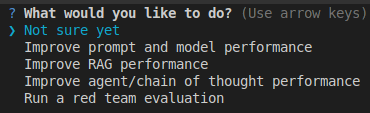
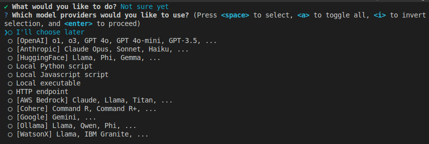
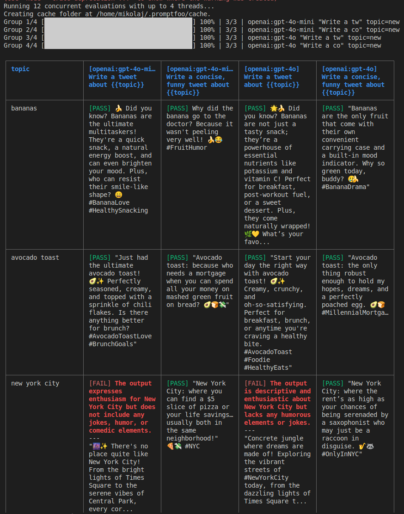
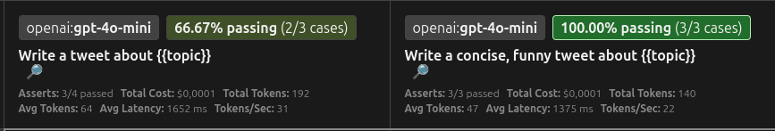
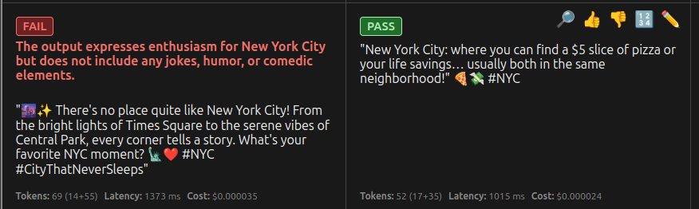

# Jak testować prompty z Promptfoo

W dynamicznym świecie generatywnej AI, tworzenie skutecznych promptów jest kluczowe do uzyskania pożądanych rezultatów. <p></p>
Jednak jak upewnić się, że nasze prompty działają zgodnie z oczekiwaniami w różnych scenariuszach i z różnymi modelami? <p></p>

Wyzwanie leży w **niedeterministycznej naturze** **Large Language Models (LLM)**. W przeciwieństwie do tradycyjnego oprogramowania, gdzie te same dane wejściowe zawsze dają ten sam wynik, **LLM** mogą generować różne odpowiedzi na ten sam prompt. Ta zmienność wynika z kilku czynników:

- Różne modele mają różne architektury, dane treningowe i możliwości
- Ten sam model może generować różne wyjścia ze względu na swoją probabilistyczną naturę
- Wydajność modelu może znacząco różnić się w zależności od typu zadania
- Odpowiedzi mogą być modyfikowane przez kontekst, ustawienia temperatury i inne parametry

Dlatego właśnie narzędzia takie jak **Promptfoo** są niezbędne. Pomagają nam:

- Porównywać, jak różne modele radzą sobie z tymi samymi promptami
- Identyfikować, które prompty działają najlepiej dla konkretnych zadań
- Mierzyć i śledzić spójność wyjść modelu
- Optymalizować prompty dla lepszej wydajności i niezawodności

**Odpowiedzią jest Promptfoo** – narzędzie do ewaluacji i porównywania promptów. <p></p>

## Zastosowanie Promptfoo w realnych scenariuszach

Zanim zaczniesz czytać - oto życiowe przykłady zastosowania Promptfoo w developmencie aplikacji wykorzystujących LLM:

1. **Tworzenie chatbota obsługi klienta:** Używasz Promptfoo do testowania różnych promptów, które mają odpowiadać na typowe pytania klientów. Sprawdzasz, czy odpowiedzi są poprawne, pomocne i w odpowiednim tonie. Testujesz różne modele, aby znaleźć ten, który najlepiej radzi sobie z zawiłościami języka klientów.
2. **Budowanie aplikacji do generowania opisów produktów:** Testujesz prompty, które mają tworzyć atrakcyjne i informatywne opisy produktów na podstawie ich cech. Używasz Promptfoo, aby upewnić się, że opisy są spójne pod względem stylu, zawierają wszystkie kluczowe informacje i mają odpowiednią długość. Porównujesz różne modele pod kątem kreatywności i dokładności generowanych opisów.
3. **Rozwijanie narzędzia do analizy opinii użytkowników:** Testujesz prompty, które mają klasyfikować opinie klientów jako pozytywne, negatywne lub neutralne. Promptfoo pomaga ocenić dokładność tej klasyfikacji dla różnych typów opinii i języków. Sprawdzasz, jak zmiany w promptach wpływają na precyzję analizy.
4. **Implementacja funkcji generowania kodu:** Tworzysz narzędzie, które na podstawie opisu użytkownika generuje fragmenty kodu. Używasz Promptfoo do testowania różnych promptów pod kątem poprawności składni generowanego kodu, jego funkcjonalności i zgodności z opisem użytkownika. Porównujesz różne modele pod kątem jakości generowanego kodu w różnych językach programowania.
5. **Tworzenie aplikacji do streszczania artykułów:** Testujesz prompty, które mają tworzyć krótkie i zwięzłe podsumowania długich tekstów. Promptfoo pomaga ocenić, czy podsumowania zachowują kluczowe informacje i są zrozumiałe. Porównujesz różne modele pod kątem jakości i długości generowanych streszczeń.

**W każdym z tych przypadków Promptfoo pomaga deweloperom systematycznie testować, porównywać i optymalizować użycie modeli językowych, zapewniając wyższą jakość i niezawodność tworzonych aplikacji.**

W tym artykule przeprowadzę Cię przez proces instalacji, pierwszej ewaluacji, wizualizacji wyników, ich szczegółowego omówienia oraz próbie wyciągnięcia wniosków.

**Artykuł opisuje kroki dla Ubuntu na powłoce Bash. Użytkownicy innych systemów powinni sprawdzić dokumentację Promptfoo pod kątem odpowiednich instrukcji, ponieważ instalacja Node.js i menedżerów pakietów może się różnić.**

Wersje z których korzystam w artykule: <p></p>
**Node:** 22.6.0 <br />
**NPM:** 10.9.1 <br />
**Promptfoo:** 0.112.4

## 1. Instalacja Promptfoo

Zanim zanurzymy się w świat ewaluacji, musimy zainstalować `Promptfoo`. Jest to narzędzie oparte na `Node.js`, więc upewnij się, że masz zainstalowane środowisko `Node.js` oraz menedżer pakietów `npm` (zazwyczaj instalowany razem z Node.js).

Otwórz terminal i wykonaj następującą komendę:

```bash
npm install -g promptfoo
```

Ta komenda zainstaluje `Promptfoo` globalnie w Twoim systemie, dzięki czemu będziesz mógł korzystać z niego w dowolnym projekcie. <p></p>

Po zakończeniu instalacji możesz sprawdzić, czy wszystko przebiegło pomyślnie, wpisując:

```bash
npx promptfoo --version
```

Jeśli zobaczysz numer zainstalowanej wersji `Promptfoo`, oznacza to, że instalacja zakończyła się sukcesem.

## 2. Przygotowanie środowiska testowego – tworzymy dedykowany folder

Dla lepszej organizacji pracy, zaleca się utworzenie dedykowanego folderu, w którym będziemy przechowywać pliki konfiguracyjne Promptfoo oraz inne powiązane zasoby. Wybierz dogodną lokalizację na swoim dysku i wykonaj następujące polecenia w terminalu:

```bash
mkdir promptfoo_project
cd promptfoo_project
```

Od teraz wszystkie pliki konfiguracyjne Promptfoo będziemy tworzyć wewnątrz tego folderu.

## 3. Konfiguracja Promptfoo

Mając zainstalowane `Promptfoo` i przygotowane środowisko, możemy przystąpić do pierwszej ewaluacji. W tym kroku zdefiniujemy podstawową konfigurację testów oraz wybierzemy modele, które chcemy przetestować.

### Definicja testów:

Testy w Promptfoo definiowane są w plikach konfiguracyjnych (zazwyczaj w formacie `YAML` lub `JSON`). Określasz w nich prompty, które chcesz przetestować, oraz różne przypadki testowe (dane wejściowe). <p></p> Możesz także zdefiniować asertywności – oczekiwane właściwości wyjść modelu dla każdego przypadku testowego (o tym i innych składowych wyników będzie więcej w dalszej części tekstu).

Chociaż konfigurację można przeprowadzić ręcznie, w tym przewodniku skorzystamy z interaktywnego narzędzia `Promptfoo` do inicjalizacji podstawowej konfiguracji. Upewnij się, że nadal znajdujesz się w folderze `promptfoo_project` i wykonaj polecenie:

```bash
promptfoo init
```

Po uruchomieniu tego polecenia, `Promptfoo` poprosi Cię o podjęcie kilku decyzji dotyczących Twojej konfiguracji testowej.

Na pierwszym ekranie zobaczysz listę opcji, które pomogą `Promptfoo` w skonfigurowaniu początkowych testów zgodnie z Twoimi zamierzeniami:

1. **Not sure yet:** Wybierz tę opcję, jeśli dopiero zaczynasz i chcesz ogólnie zapoznać się z Promptfoo. **Jest to najbardziej odpowiednia opcja dla pierwszej ewaluacji i właśnie ją wybierz.**
2. **Improve prompt and model performance:** Ta opcja jest idealna, jeśli chcesz porównać różne prompty lub modele pod kątem konkretnego zadania.
3. **Improve RAG performance:** Wybierz tę opcję, jeśli testujesz system Retrieval-Augmented Generation i chcesz ocenić, jak dobrze Twoje prompty wykorzystują pobrane informacje.
4. **Improve agent/chain of thought performance:** Ta opcja jest przeznaczona do testowania bardziej złożonych systemów, takich jak agenci AI lub łańcuchy myśli.
5. **Run a red team evaluation:** Wybierz tę opcję, jeśli chcesz ocenić, jak dobrze Twój model radzi sobie z potencjalnie szkodliwymi lub niepożądanymi zapytaniami.



Na drugim ekranie `Promptfoo` zapyta Cię o dostawców modeli językowych, z których chcesz korzystać:

Możesz wybrać jednego lub więcej dostawców, naciskając spację przy wybranej opcji. Jeśli nie jesteś jeszcze pewien, których modeli chcesz użyć, możesz wybrać **"Choose later"** (domyślnie zaznaczone) i zatwierdzić. Będziesz mógł dodać i skonfigurować modele później w pliku konfiguracyjnym. **Wybierz opcję ("Choose later").**



Po udanej inicjalizacji, w Twoim folderze `promptfoo_project` powinien znajdować się plik `promptfooconfig.yaml` o podobnej strukturze do poniższej:

```yaml
# yaml-language-server: $schema=https://promptfoo.dev/config-schema.json

# Learn more about building a configuration: https://promptfoo.dev/docs/configuration/guide

description: "My eval"

prompts:
  - "Write a tweet about {{topic}}"
  - "Write a concise, funny tweet about {{topic}}"

providers:
  - "openai:gpt-4o-mini"
  - "openai:gpt-4o"

tests:
  - vars:
      topic: bananas

  - vars:
      topic: avocado toast
    assert:
      # For more information on assertions, see https://promptfoo.dev/docs/configuration/expected-outputs

      # Make sure output contains the word "avocado"
      - type: icontains
        value: avocado

      # Prefer shorter outputs
      - type: javascript
        value: 1 / (output.length + 1)

  - vars:
      topic: new york city
    assert:
      # For more information on model-graded evals, see https://promptfoo.dev/docs/configuration/expected-outputs/model-graded
      - type: llm-rubric
        value: ensure that the output is funny
```

Ten plik definiuje konfigurację testów dla Promptfoo. <p></p> Przyjrzyjmy się sekcjom `prompts`, `providers` i `tests`, aby zrozumieć, jak definiowane są testy i asertywności.

### Definicja testów i asertywności na przykładzie konfiguracji:

Najpierw omówię przeznaczenie poszczególnych sekcji, a następnie przejdziemy do analizy konkretnych przykładów z naszego pliku.

```yaml
description: "My eval"
```

Nazwa naszej ewaluacji.

```yaml
prompts:
  - "Write a tweet about {{topic}}"
  - "Write a concise, funny tweet about {{topic}}"
```

Sekcja `prompts` definiuję listę promptów, które będą używane w testach. W tym przykładzie mamy dwa prompty:

- `"Write a tweet about {{topic}}"` - Prosty prompt, który prosi o napisanie tweeta na określony temat. `{{topic}}` jest zmienną, która zostanie zastąpiona konkretnymi wartościami z sekcji `tests`.
- `"Write a concise, funny tweet about {{topic}}"` - Bardziej szczegółowy prompt, który prosi o napisanie krótkiego i zabawnego tweeta na dany temat.

```yaml
providers:
  - "openai:gpt-4o-mini"
  - "openai:gpt-4o"
```

Sekcja `providers` określa listę modeli językowych, które będą używane do generowania odpowiedzi na zdefiniowane prompty. Domyślnie zostały wybrane dwa modele OpenAI: `gpt-4o-mini` i `gpt-4o`. Promptfoo wyśle te same prompty do każdego z tych modeli.

```yaml
tests
```

Sekcja `tests` definiuje konkretne przypadki testowe (`vars`) i oczekiwania (`asserts`) dla tych przypadków. Każdy główny element na liście w sekcji tests reprezentuje jeden lub więcej testów (w zależności od liczby promptów i dostawców). <p></p>

```yaml
tests:
  - vars:
      topic: bananas

  - vars:
      topic: avocado toast
    assert:
      # For more information on assertions, see https://promptfoo.dev/docs/configuration/expected-outputs

      # Make sure output contains the word "avocado"
      - type: icontains
        value: avocado

      # Prefer shorter outputs
      - type: javascript
        value: 1 / (output.length + 1)

  - vars:
      topic: new york city
    assert:
      # For more information on model-graded evals, see https://promptfoo.dev/docs/configuration/expected-outputs/model-graded
      - type: llm-rubric
        value: ensure that the output is funny
```

`vars` <p></p>
Zmienne które będą wstawiane w podwójne nawiasy klamrowe jako tematy na których będzie się skupiał prompt.

Na przykład:

```yaml
- vars
  topic: bananas
```

Zamieni tą frazę: `Write a tweet about {{topic}}`
Na tą: `Write a tweet about bananas`

I tak dalej... :)

`assert`

**Asertywności (Assertions):** To reguły lub oczekiwania, które definiujesz dla wyjść modelu (wyjaśnienie wyjścia modelu poniżej) w odpowiedzi na dany prompt i przypadek testowy. Asertywności mówią Promptfoo, co uważasz za "poprawną" lub "akceptowalną" odpowiedź. Przykłady asertywności to:

- `contains`: "Poznań" - oczekujesz, że wyjście modelu będzie zawierać słowo "Poznań".
- `not-contains`: "deszczowy" - oczekujesz, że wyjście modelu nie będzie zawierać słowa "deszczowy".
- `equals`: "Słonecznie" - oczekujesz, że wyjście modelu będzie dokładnie równe "Słonecznie".
- `is-json`: - oczekujesz, że wyjście modelu będzie poprawnym formatem JSON.

Więcej o asertywności w dokumentacji: https://www.promptfoo.dev/docs/configuration/expected-outputs/

**Wyjścia modelu** to rezultaty lub odpowiedzi generowane przez model sztucznej inteligencji w reakcji na otrzymane zapytanie (prompt) i dane wejściowe.

Mogą przyjmować różne formy, w zależności od typu modelu i zadania, do którego został wytrenowany. Przykłady wyjść modelu to:

- **Tekst:** Najczęstsza forma wyjścia w przypadku modeli językowych (LLM). Może to być odpowiedź na pytanie, podsumowanie tekstu, tłumaczenie, wygenerowany artykuł, kod programistyczny, tweet, scenariusz, itp.
- **Obrazy:** Modele generujące obrazy (np. DALL-E, Stable Diffusion) tworzą nowe obrazy na podstawie opisów tekstowych.
- **Audio:** Modele syntezy mowy generują dźwięk mowy na podstawie tekstu.
- **Wideo:** Niektóre zaawansowane modele potrafią generować krótkie sekwencje wideo.
- **Kod:** Modele programistyczne mogą generować fragmenty kodu w różnych językach programowania.
- **Dane strukturalne:** Modele mogą generować dane w określonych formatach, takich jak JSON lub CSV.
- **Decyzje lub akcje:** W przypadku modeli agentów AI, wyjściem mogą być podjęte decyzje lub wykonane akcje w danym środowisku.

**W kontekście Promptfoo, wyjścia modelu to te konkretne teksty, obrazy, kody itp., które model wygenerował w odpowiedzi na Twoje prompty i przypadki testowe. Promptfoo następnie porównuje te wyjścia z Twoimi zdefiniowanymi asertywnościami, aby ocenić, czy są one zgodne z oczekiwaniami.**

Przyjrzyjmy się dokładniej poszczególnym testom:

- **Pierwszy test:**

```yaml
- vars:
    topic: bananas
```

Ten test definiuje zmienną topic z wartością `"bananas"`. Promptfoo użyje każdego promptu z sekcji prompts i wstawi `"bananas"` w miejsce `{{topic}}`. Nie zdefiniowano tutaj żadnych asertywności, więc `Promptfoo` jedynie zarejestruje wygenerowane odpowiedzi.

- **Drugi test:**

```yaml
- vars:
    topic: avocado toast
  assert:
    # Make sure output contains the word "avocado"
    - type: icontains
      value: avocado

    # Prefer shorter outputs
    - type: javascript
      value: 1 / (output.length + 1)
```

Ten test definiuje zmienną topic z wartością `"avocado toast"`. Dodatkowo, definiuje `sekcję assert`, która zawiera asertywności:

```yaml
# Make sure output contains the word "avocado"
- type: icontains
  value: avocado
```

Ta asertywność sprawdza, czy wygenerowana odpowiedź (bez względu na wielkość liter) zawiera słowo `"avocado"`. Jeśli odpowiedź nie zawiera tego słowa, test zakończy się niepowodzeniem dla tej kombinacji promptu i modelu.

<p></p>

```yaml
# Prefer shorter outputs
- type: javascript
  value: 1 / (output.length + 1)
```

Ta asertywność jest bardziej zaawansowana. Używa `kodu JavaScript` do oceny wyjścia. W tym przypadku oblicza wartość, która będzie wyższa dla krótszych odpowiedzi. Chociaż nie jest to typowa asertywność typu `"pass/fail"`, Promptfoo może używać takich metryk do porównywania wyników.

- **Trzeci test:**

```yaml
- vars:
    topic: new york city
  assert:
    # For more information on model-graded evals, see https://promptfoo.dev/docs/configuration/expected-outputs/model-graded
    - type: llm-rubric
      value: ensure that the output is funny
```

Ten test definiuje zmienną topic z wartością `new york city` i zawiera asertywność typu `llm-rubric`. <br />
Ta asertywność wykorzystuje inny model językowy (określony w konfiguracji globalnej lub domyślnie przez `Promptfoo`) do oceny, czy wygenerowana odpowiedź jest zabawna. Jest to przykład asertywności ocenianej przez inny model, co pozwala na bardziej subiektywne oceny jakości wyjść.

<hr />

Teraz, gdy mamy konkretny przykład pliku konfiguracyjnego, widzimy, jak definiowane są prompty (za pomocą `prompts`), przypadki testowe (za pomocą `vars`) oraz asertywności (za pomocą sekcji `assert`). <p></p>

Skoro już jesteśmy uzbrojeni w teorię to najwyższy czas żeby przejść do praktyki!

Ostatnim krokiem konfiguracji, która pozostała to przekazanie `Promptfoo` klucza dostawcy z którego chcemy skorzystać. Ja skorzystam z `OpenAI`.

### Ustawienie klucza API OpenAi (https://platform.openai.com/api-keys)

```bash
export OPENAI_API_KEY=<your-openai-api-key>
```

No i lecimy z tematem!

# 3. Uruchomienie Promptfoo:

Uruchom ewaluację za pomocą następującego polecenia

```bash
promptfoo eval
```

Twoim oczom powinien ukazać się taki widok w terminalu:



Żeby zobaczyć ˇładniejsze" i bardziej dokładne wyniki, wpisz w terminalu:

```bash
promptfoo view --yes
```

W odpowiedzi otrzymasz informację o porcie pod który musisz się udać żeby zobaczyć wyniki:

> Server running at http://localhost:15500 and monitoring for new evals.

A udając się pod ten adres w przeglądarce zobaczysz to:


# 4. Podgląd wyników – zrozumienie danych

W górnej części strony z wynikami znajduje się kilka wykresów ale nimi nie będę się tutaj zajmował.

Pod wykresami swoje miejsce zajmuje...

## Macierz testowa:

**Oś pionowa (Lewa strona):** Przedstawia zmienne, które zostały przetestowane w kontekście podanych promptów. W naszym przykładzie widzimy trzy zmienne:

- `"bananas"`
- `"avocado toast"`
- `"new york city"`)

<p></p>


<p></p>

**Oś pozioma (nagłówek):** Każda komórka nagłówka przedstawia:

- model na którym był przeprowadzany test
- procentową zdawalność testów
- treść testowanego prompta
- statystyki:

  - asertywności
  - kosztu prompta w przeliczeniu na dolary
  - całkowitej liczby zużytych tokenów
  - średniej liczby zużytych tokenów
  - średniego opóźnienia w przesyłaniu danych
  - liczby tokenów na sekundę



**Komórki macierzy:** Każda komórka w macierzy, na przecięciu promptu oraz modelu, zawiera informacje o wyniku testu dla tej konkretnej kombinacji. Widzimy w nich:

1. **Oznaczenie "PASS" lub "FAIL":** Wskazuje, czy wygenerowana odpowiedź spełniła wszystkie zdefiniowane asertywności dla danego przypadku testowego. Zielony kolor komórki oznacza `PASS`, a czerwony - `FAIL`.

2. **Podgląd wygenerowanego wyjścia:** W komórce znajduje się krótki fragment wygenerowanej odpowiedzi, co pozwala na szybką ocenę wizualną.

3. **Szczegóły nieudanych asertywności (w przypadku "FAIL"):** Jeśli test zakończył się niepowodzeniem, w komórce lub po jej rozwinięciu mogą być widoczne informacje o tym, która konkretnie asertywność nie została spełniona i dlaczego (jak widzimy na przykładzie "new york city" dla obu modeli).

4. **Dodatkowe ikony lub wskaźniki:** Klikając na odpowiednie ikony możemy:

   - otworzyć podgląd i sprawdzić detale konkretnego przypadku testowego
   - jeśli uznamy to za bardziej adekwatne to manualnie zmienić wynik testu na `FAILED/PASSED`
   - ustawić manualnie `Test Score` (liczba od 0.0 do 1.0) aby ocenić, jak dobra była odpowiedź modelu w teście.
   - dodać komentarz



## Jakie wnioski można wyciągnąć z macierzy testowej?

1. **Porównanie wydajności modeli dla danego promptu:** Przeglądając wiersz odpowiadający konkretnemu promptowi, możemy bezpośrednio porównać, jak różne modele radziły sobie z tym promptem dla wszystkich przypadków testowych. Możemy zobaczyć, który model częściej generował poprawne odpowiedzi (więcej zielonych komórek) i dla których konkretnie przypadków testowych występowały problemy. Na przykład, możemy zauważyć, że `gpt-4o` radzi sobie tak samo z generowaniem zabawnych tweetów o `"new york city"` jak `gpt-4o-mini`.

2. **Ocena skuteczności promptu dla danego modelu:** Przeglądając kolumnę odpowiadającą konkretnemu modelowi, możemy zobaczyć, jak ten model radził sobie z różnymi promptami i przypadkami testowymi. Możemy zidentyfikować, które prompty generalnie działają lepiej z danym modelem. Na przykład, możemy zauważyć, że oba modele mają wyższy wskaźnik sukcesu dla prostszego promptu `"Write a tweet about..."` w porównaniu do promptu wymagającego humoru.

3. **Identyfikacja problematycznych przypadków testowych:** Analizując kolumnę dla konkretnego przypadku testowego (czyli patrząc na wyniki dla danej wartości zmiennej `topic` we wszystkich promptach i modelach), możemy zobaczyć, które przypadki są najbardziej wymagające i gdzie najczęściej dochodzi do niepowodzeń. Na przykład, `"new york city"` wydaje się być trudniejszym tematem, szczególnie jeśli chodzi o spełnienie asertywności związanej z humorem.

4. **Zrozumienie przyczyn niepowodzeń:** Klikając na komórkę o statusie `"FAIL"` lub rozwijając jej szczegóły, możemy dowiedzieć się, która konkretnie asertywność nie została spełniona. To daje nam cenne informacje o tym, co poszło nie tak i w jakim aspekcie wygenerowana odpowiedź nie spełniła oczekiwań. Na przykład, dla `"new york city"` widzimy, że nie udało się spełnić asertywności `"ensure that the output is funny"`.

5. **Szybka wizualna ocena:** Kolorowanie komórek (zielony/czerwony) pozwala na szybkie, intuicyjne zrozumienie ogólnej wydajności różnych kombinacji promptów i modeli. Obszary z przewagą zielonych komórek wskazują na skuteczne konfiguracje, a obszary z czerwonymi komórkami wymagają dalszej analizy i potencjalnych ulepszeń.

Podsumowując, macierz testowa w Promptfoo jest kluczowym narzędziem do wizualnego porównywania wydajności różnych promptów i modeli w różnych scenariuszach testowych. Pozwala na szybkie identyfikowanie mocnych i słabych stron naszych konfiguracji oraz dostarcza punkt wyjścia do dalszej analizy i optymalizacji.

## Źródła

1. [Promptfoo Official Documentation](https://www.promptfoo.dev/)
2. [Generative AI Evaluation with Promptfoo: A Comprehensive Guide](https://medium.com/@yukinagae/generative-ai-evaluation-with-promptfoo-a-comprehensive-guide-e23ea95c1bb7)
3. Personal experience with Promptfoo and general knowledge about LLMs
4. Model Gemini 2.0 Flash do pomocy w tłumaczeniu i edycji tekstów
